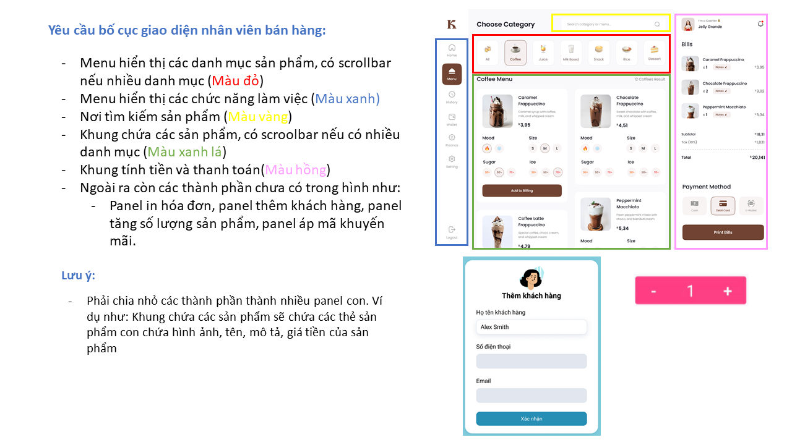

# Folder này sẽ chứa các thư mục liên quan đến nhân viên bán hàng
Các thành phần của frame chính bao gồm: 
- Thanh danh mục loại sản phẩm
- Thanh tác chức năng /tác vụ thực hiện
- Khung tìm kiếm tên sản phẩm
- Khung chứa các sản phẩm: hình ảnh của sản phẩm, tên sản phẩm, giá tiền, mô tả (nếu đủ chỗ hoặc dùng tooltip), nút mua hàng (hoặc click vào panel của sản phẩm)
- Khung thanh toán tiền: hiển thị danh sách các sản phẩm đã thêm và thay đổi số lượng, ô nhập SDT khách hàng và xác nhận, ô nhập mã khuyến mãi và xác nhận

Ngoài ra sẽ có các thành phần phụ như:
- Frame dùng để thêm khách hàng

